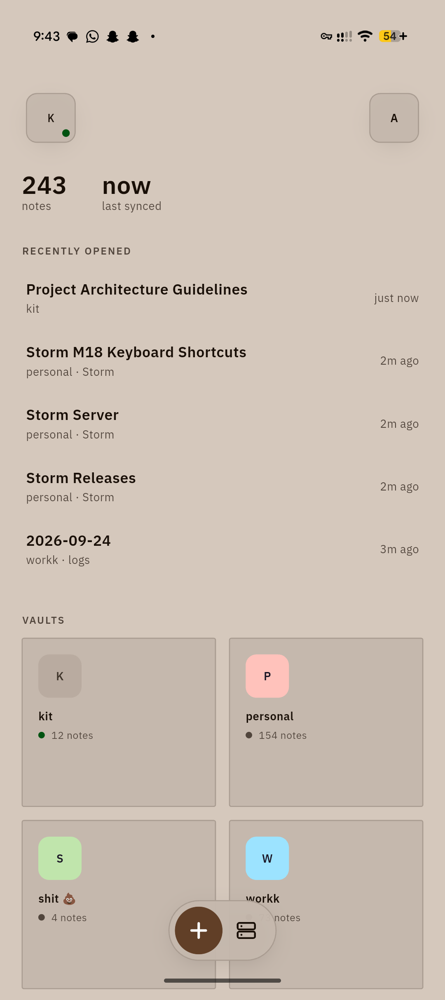
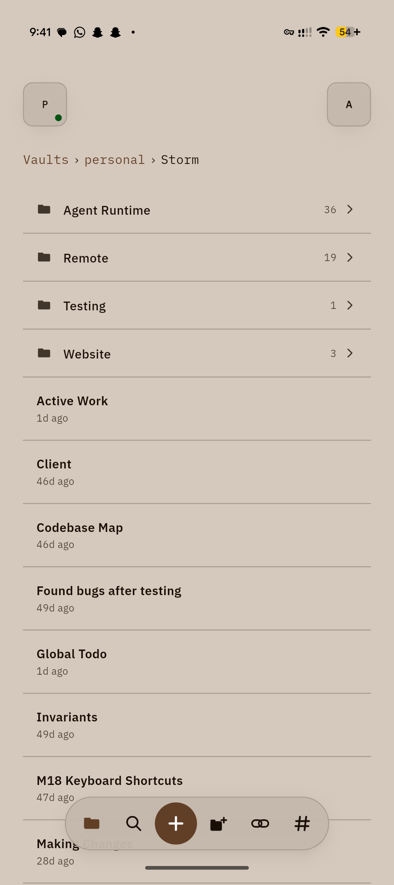
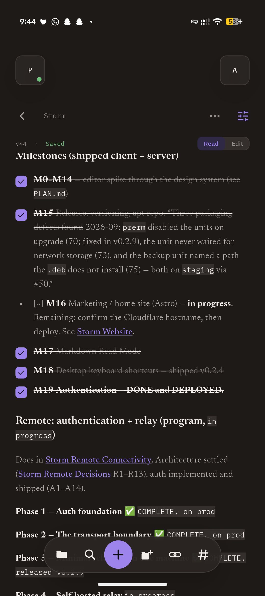
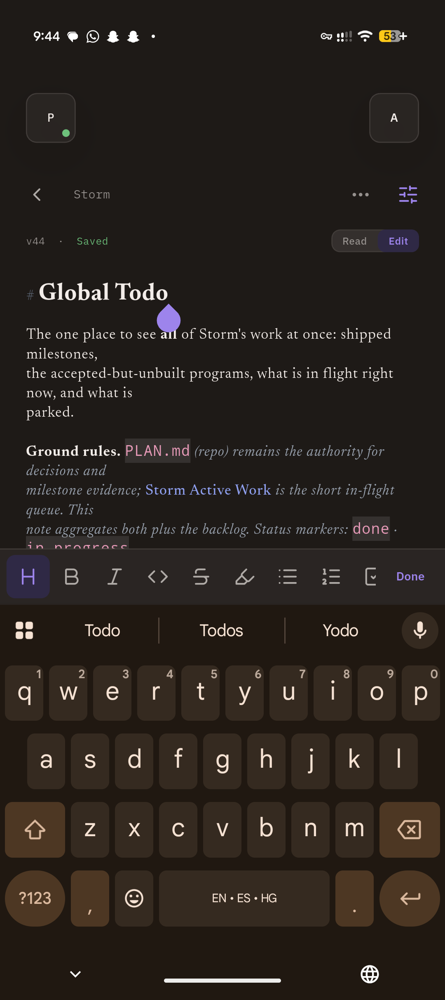
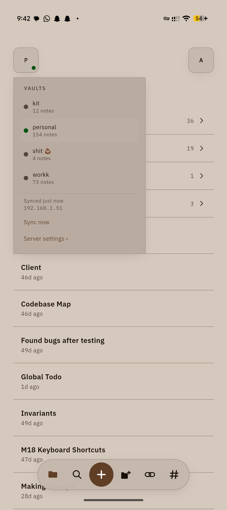
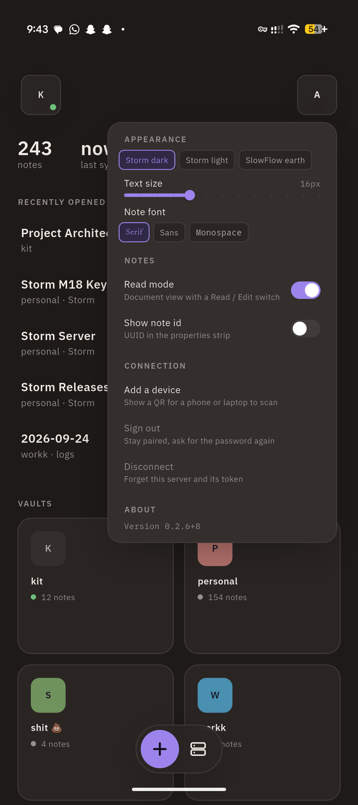
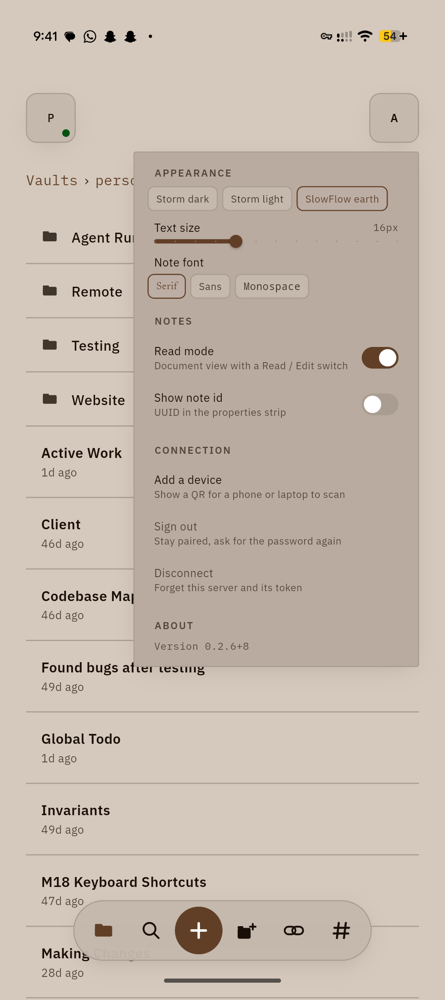
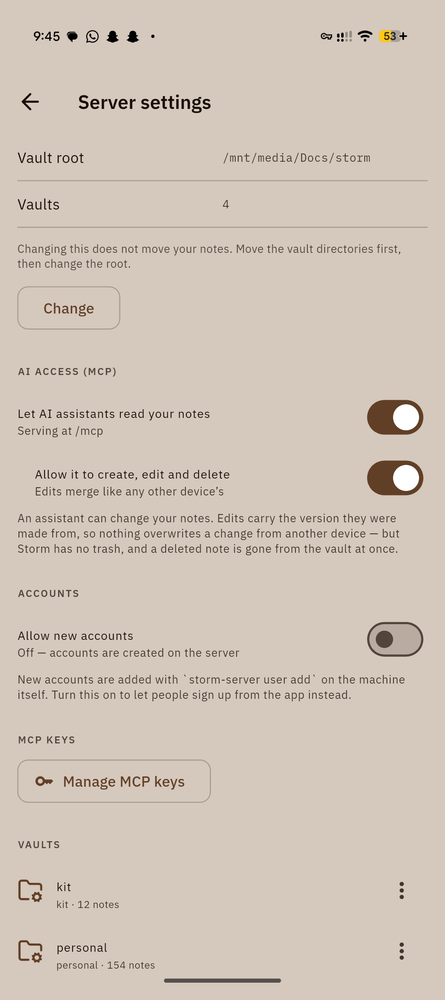

# Storm

Self-hosted, Markdown-native knowledge system. A Rust sync server owns the
canonical vaults on infrastructure you control; Flutter clients on macOS,
Android, and web keep pace, offline included. The same knowledge is available
to AI agents through MCP, and an optional relay reaches the server from outside
your network without opening a port.

> **Your knowledge. On your infrastructure.**

Site: [storm.dewansh.space](https://storm.dewansh.space) ·
Clients: [storm.dewansh.space/clients](https://storm.dewansh.space/clients) ·
Releases: [GitHub Releases](https://github.com/dewanshDT/Storm/releases)

```
┌──── clients (one Dart codebase) ────┐      ┌── AI agents ──┐
│  macOS · Android · Web              │      │  MCP clients  │
│  editor · cache · outbox · sync     │      └───────┬───────┘
└──────┬───────────────────┬──────────┘              │
  REST + WebSocket     via storm-relay          MCP (/mcp)
  (LAN)                (optional, SRP v1)            │
┌──────┴───────────────────┴─────────────────────────┴──┐
│  storm-server (Rust, axum)                            │
│  3-way merge · FTS5 · watcher · pairing + sessions    │
└──────┬───────────────────┬────────────────────────────┘
  vaults/*.md           state/
  plain markdown        registry · indexes · auth.db · identity
```

Notes stay ordinary `.md` files under a storage root you control. Storm’s own
state lives in a sibling `state/` directory — never inside the vaults.

## Screenshots

The Android client, in the SlowFlow earth and Storm dark themes.

<table>
  <tr>
    <td align="center"><br><sub>Dashboard</sub></td>
    <td align="center"><br><sub>Folders</sub></td>
    <td align="center"><br><sub>Read mode</sub></td>
    <td align="center"><br><sub>Edit mode</sub></td>
  </tr>
  <tr>
    <td align="center"><br><sub>Vault switcher</sub></td>
    <td align="center"><br><sub>Storm dark</sub></td>
    <td align="center"><br><sub>SlowFlow earth</sub></td>
    <td align="center"><br><sub>Server settings</sub></td>
  </tr>
</table>

## Install (server)

Debian / Ubuntu — apt bootstrap, then start:

```sh
curl -fsSL https://dewanshdt.github.io/Storm/install.sh | sudo sh
sudo storm-server up
sudo storm-server status
```

That URL is the **apt repository** root (not the marketing site). `up` creates
the `storm` user and data root (`/srv/storm`), writes `/etc/storm/storm.env`
and enables the service; the web client is served from the same port.

### Pair the first device

There is no shared token. Accounts, per-device sessions and MCP keys are the
only credentials. While the server has no users, `pair` prints a single-use
pairing URI — `--qr` also draws it as a code for a phone to scan:

```sh
sudo -u storm storm-server pair --state /srv/storm/state --qr
```

The first account is an owner; add more from the app or with `storm-server
user`. Details: [`deploy/README.md`](deploy/README.md#user-accounts).

### Update

```sh
sudo apt update
sudo apt install --only-upgrade storm-server
sudo systemctl restart storm-server
sudo storm-server status
```

Current release: **v0.2.9** (pre-release). Clients (macOS zip, Android APK,
web UI) are on [Releases](https://github.com/dewanshDT/Storm/releases) and the
[Clients page](https://storm.dewansh.space/clients).

### Relay (optional)

`storm-relay` lets clients reach a server from outside its network: the server
dials out to the relay, so nothing is port-forwarded. It is a separate package
in the same apt repository and nothing depends on it. The relay holds no vault
data and authenticates no one — a client's credential rides inside the tunnel
to the origin server, which checks it exactly as it would on the LAN. Setup,
TLS and key bindings: [`deploy/README.md`](deploy/README.md#relay-optional);
wire spec: [`docs/srp-v1.md`](docs/srp-v1.md).

## Layout

| Path | What |
|---|---|
| [`apps/server`](apps/server/README.md) | Rust sync server — REST, WebSocket, MCP, auth |
| [`apps/relay`](apps/relay) | `storm-relay`, the SRP v1 relay (standalone crate, no workspace) |
| [`apps/client`](apps/client/README.md) | Flutter app — macOS, Android, web (Linux desktop deferred) |
| [`apps/www`](apps/www/README.md) | Marketing site (Astro) → [storm.dewansh.space](https://storm.dewansh.space) |
| [`deploy/`](deploy/README.md) | systemd units, apt bootstrap, backup, relay setup |
| [`docs/`](docs) | Design briefs, editor findings, the relay spec and its test vectors |
| [`PLAN.md`](PLAN.md) | Living plan, status, and decision log |

## Development

Requires Rust and Flutter. Point the server at a directory that **contains**
vaults (`VAULT_ROOT`), not at a single vault:

```sh
make dry-run VAULT_ROOT=~/vaults-copy   # report only — writes nothing
make server  VAULT_ROOT=~/vaults-copy   # http://127.0.0.1:8484
make client                             # or: make web / make serve-web
make www-dev                            # marketing site locally
```

Pair a client with the dev server from `apps/server`:
`cargo run -- pair --state ../../.dev/state --addr http://127.0.0.1:8484`.
`make help` lists every target.

## Testing

```sh
make check        # fmt-check + clippy + analyze + every unit suite
make test-live    # starts servers, runs the integration suites, tears down
```

Unit suites (server, relay, client) need nothing running. Live suites drive the
real client against a real server — sync, MCP and auth each have their own.

## MCP

When enabled, the server exposes Storm over Streamable HTTP at `/mcp`: eleven
read tools (vaults, search, notes, related notes, tags, recents, history,
versions, and scripts from the kit vault) always, plus five write tools
(create / update / delete note, create / update script) in read-write mode.
Off by default and switched at runtime from **Server ▸ AI access**; agents
authenticate with MCP keys minted in the app. Updates carry a `base_version`
into the same three-way merge the clients use. See
[`apps/server/README.md`](apps/server/README.md#mcp).

## Status

M0–M15, M18 (desktop shortcuts) and M19 (auth phase 1 — server identity,
accounts, pairing, sessions, MCP keys) are done; the shared token is gone.
The relay is built and released (v0.2.9 ships the first `storm-relay`); next is
running it on a public VPS. M16 (marketing site, live at
[storm.dewansh.space](https://storm.dewansh.space)) and M17 (Markdown read
mode) are in progress. Per-vault authorization is its own later release.

See [`PLAN.md`](PLAN.md) for milestone status, the decision log, and open
items. License: [MIT](LICENSE).
